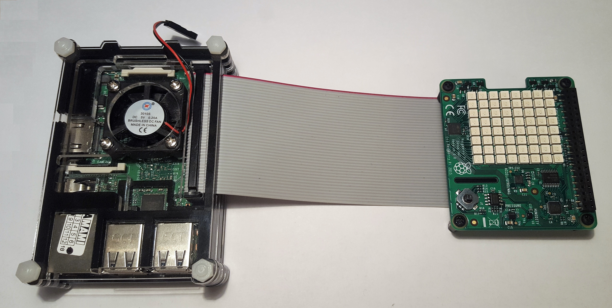
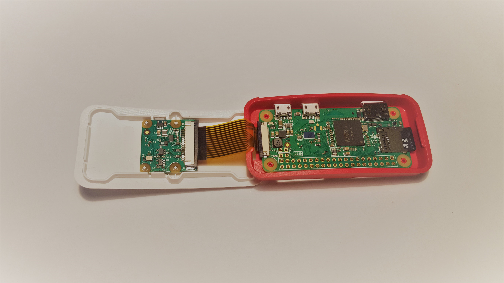
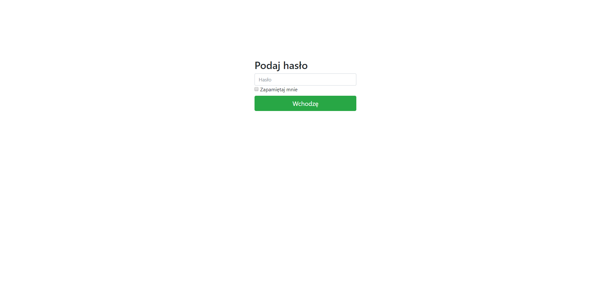
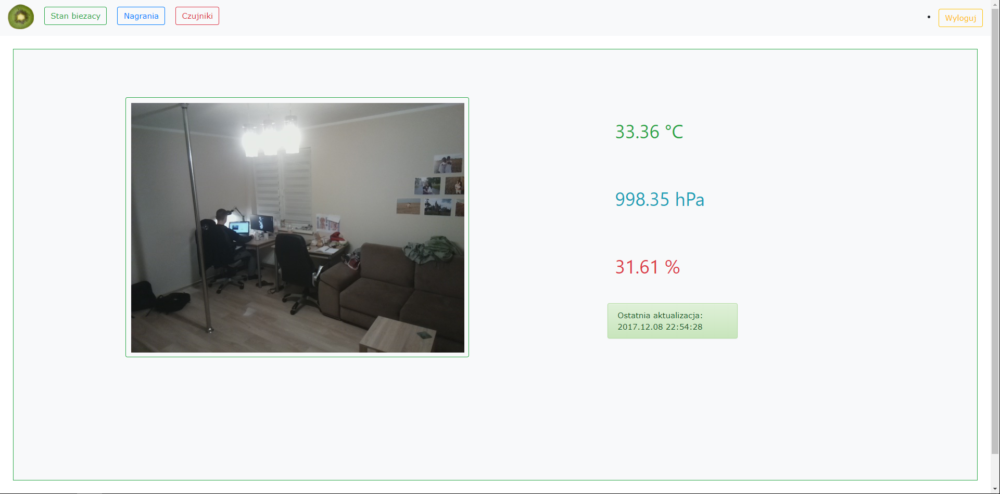
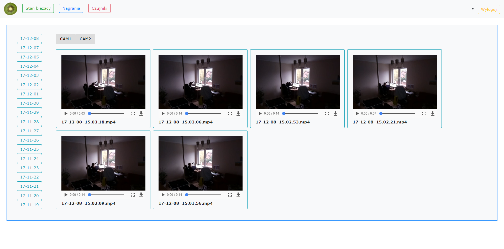
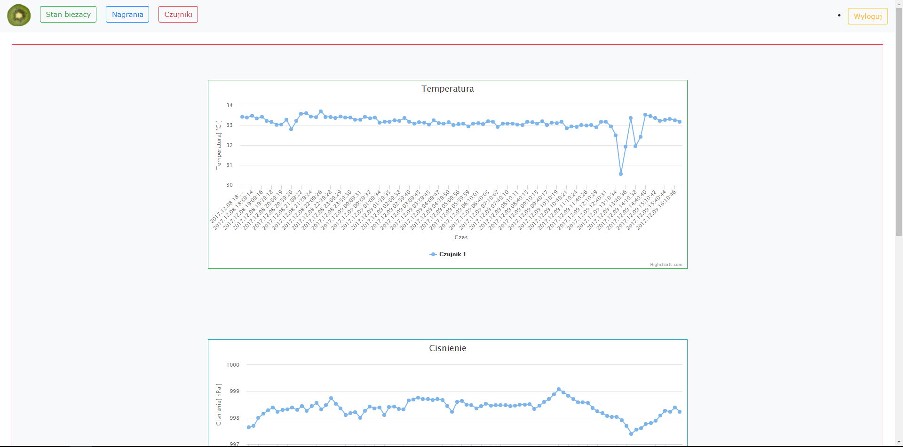
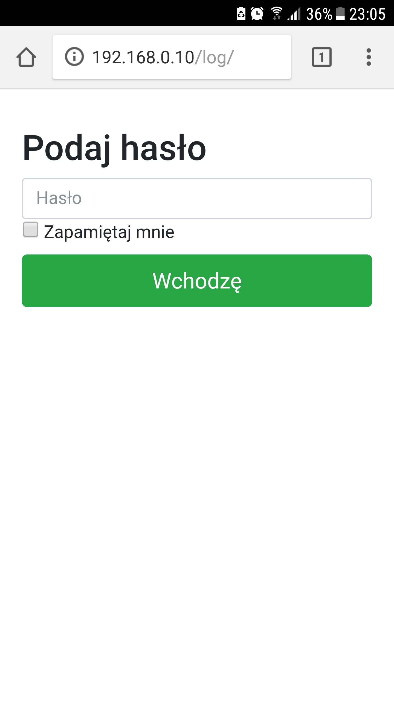
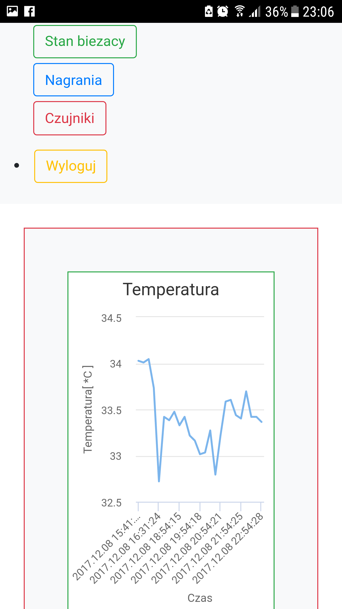

# House interior monitor

## Abstract
This project allows you to monitor your house interior. 
It checks your air parameters like temperature, humidity and pressure and records the rooms with cameras. 
Data is collected in a database and is displayed for users on the browser.
System consists of one server which gives you access to data and at least one sensor which collects data.

## Technologies
- Python
- Flask
- Bootstrap
- MySQL
- Raspberry Pi
- Apache

# Description
This system was built on Raspberry Pi with some extensions. 
All programs for this application work in Python.
Main application written in Flask, it works with Bootstrap library and has connection to database. It displayed a video from recording your interior and history of air parameters.
To access the data it was necessary to login.
Data was kept in the database by default by 21 days and after this time it was automatically deleted.
It was possible to change this time period.
Data can be collected from many sources so if you connect a few cameras and sensors it can be handled properly.

I didn't have enough budget to buy another Raspberry Pi 3 so on the same board was connected to the Sense HAT extension which allows me to measure air parameters like temperature, humidity and pressure.
Because the board interfered with the temperature measurements it was necessary to connect extensions by some cords.
Third program checks the sensors and sends http requests with measurements to the API. 
Below you can see how the main board looks like.

For recording house interior it was used to board Raspberry Pi 0W.
To the board was connected a Raspberry Module Camera v2.
This board was installed with another program which records videos and sends them to the main one by SFTP.
This program also has a feature which starts an app for recording immediately after the OS starts.
Also if the main application did not respond it recording was saved on local storage and waiting for access to it.
If it works correctly again it sends all saved movies.

# Requirements
- Raspberry Pi 3
- Raspberry Sense HAT
- Raspberry Pi OW
- Raspberry Module Camera v2
- Raspbian OS System
- Python
- MySQL database
- Apache

# Installation
To make the system work it is necessary to do a few steps.
First you need to install a Raspbian OS system for every board and Set Static IP and install python with pip.
You can set it in */etc/dhcpcd.conf*
You should configure your home router to have access to the server.
You can also configure DNS to add some dominant to your application
Next you have to connect extensions appropriately to every board.
In every application you will find *user_conf_file.py* for configuration.

# Server
To configure the server first download Apache Server and MySQL database.
Next copy all scripts from gui directory to */var/www/FlaskApp/*.
Make sure that path structure looks like */var/www/FlaskApp/FlaskApp/*

# Air sensor
For board where Sense Hat in connected you need to install *sense_hat* python library.
Next got to *air_sensor* directory.
Copy files from *app* to */usr/local/sbin/* on Raspberry board and *skrypt.sh* to */etc/init.d/skrypt.sh*.
Remember to give root permissions and make this scripts executable.

# Camera
For board where Camera Module is connected you need to install *pi_camera* python module.
Next you have to similar like for air sensors copy files form *app* directory to */usr/local/sbin/* and *skrypt.sh* to */etc/init.d/skrypt.sh*. 

# Tutorial
When you open your browser on the correct http address you should see a login page. You should write a password which you set in the GUI configuration file.

After login you will see the Home Page. 
This page presents your view from the current camera.
You can choose what camera view and data from the sensor be displayed.
On the top you can see a navigation bar. 
There are three buttons.
If you press the green button one you will go to the Home Page.
In the middle blue redirect you to recording and the last one to air parameters visualisation.

In next tab you can see recording. You can play every video, maximise it and download. Below video you can see a name of it. Every name give you information what time it was recorded. On the left you can see a button which shows previous recordings. Just above the first line of recording you tabs which every of them show recording from different cameras. You can play video

Last tab gives you access to the history of air parameters. 
There was only one sensor so there were no tabs for it.
You can choose how much data should be displayed in the configuration file. 

You also have access to data on your mobile.

